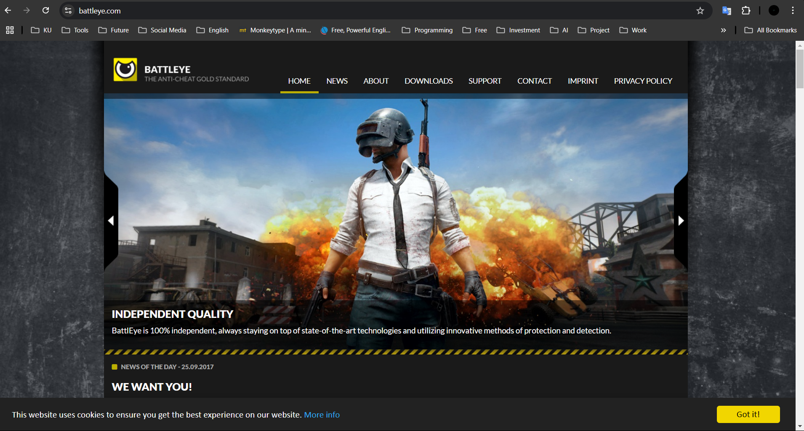

# **Security Control**

---

---

## **BattlEye**

**BattlEye** เป็นโปรแกรมที่ทำหน้าที่เป็น **Anti-Cheat Software** ใช้ในการการตรวจจับและป้องกันโปรแกรมโกงที่ผู้เล่นเกมออนไลน์เเบบ RealTime ใช้ เพื่อรักษาความยุติธรรมในการเล่นกับผู้เล่นทุกคน

---

### **ประเภทของ Security Control**

- **ประเภท (Type of Security Control):** **Technical เพราะ ตรวจจับและป้องกันการโกง เช่น การสแกนกระบวนการทำงานในระบบ,การตรวจสอบไฟล์ที่ไม่พึงประสงค์, และการบล็อกโปรแกรมโกงผ่านซอฟต์แวร์โดยตรง**
 

- **ฟังก์ชันของการควบคุม (Control Function):** **Preventative เพราะ มุ่งเน้นที่การป้องกันปัญหาการโกงก่อนที่จะเกิดผลกระทบต่อระบบหรือผู้เล่น เเละ มีการบล็อกผู้เล่นที่ใช้โปรแกรมโกงทันทีแบบเรียลไทม์ เพื่อป้องกันไม่ให้การโกงนั้นส่งผลกระทบในเกม**  

---

### **คุณสมบัติสำคัญ**

BattlEye จัดอยู่ในประเภท **Technical Preventive Control** เพราะมีคุณสมบัติในการ:  
- ตรวจสอบและบล็อกโปรแกรมโกงที่รู้จักล่วงหน้า 
- ตรวจจับพฤติกรรมที่ผิดปกติในระบบของผู้เล่น  
- อัปเดตฐานข้อมูลโปรแกรมโกงอย่างต่อเนื่องเพื่อป้องกันการโกงใหม่ ๆ
- ปิดการทำงานของผู้เล่นที่พยายามโกงแบบ RealTime

---

### **สรุป**

BattlEye คือ ซอฟต์แวร์ป้องกันการโกง ที่ถูกใช้งานในเกมออนไลน์ชั้นนำจำนวนมาก ทำหน้าที่เป็นเครื่องมือ**ป้องกันทางเทคนิค (Technical Control** และ**เชิงป้องกัน (Preventative Function)** เพื่อเสริมสร้างความมั่นคง ความยุติธรรม และความน่าเชื่อถือในชุมชนเกม
